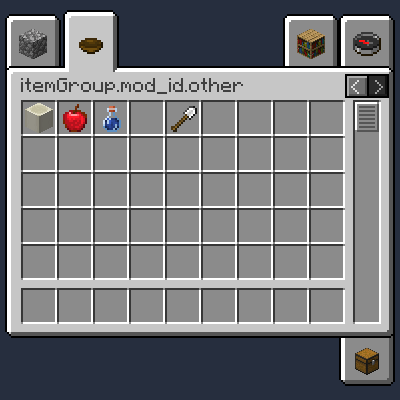

# Groupes d'objets

### Créer un groupe d'objets simple

Pour que votre `ItemGroup` apparaisse correctement dans le menu créatif,
utilisez le `FabricItemGroupBuilder` pour le créer.

```java
public class ExampleMod implements ModInitializer
{
    // ...
    public static final ItemGroup ITEM_GROUP = FabricItemGroupBuilder.build(
        new Identifier("tutorial", "general"),
        () -> new ItemStack(Blocks.COBBLESTONE));
    
    public static final ItemGroup OTHER_GROUP = FabricItemGroupBuilder.create(
        new Identifier("tutorial", "other"))
        .icon(() -> new ItemStack(Items.BOWL))
        .build();
    // ...
}
```

Une fois que `FabricItemGroupBuilder#build` est appelé, votre groupe
sera ajouté à la liste des groupes d'objets dans le menu créatif.

Assurez-vous de remplacer les arguments \[1\] que vous insérez dans le
constructeur `Identifier` par votre ID de mod réel et par la clé de
traduction que vous souhaitez donner à votre groupe d'objets \[2\].

#### Ajouter vos objets dans votre groupe d'objets

Lors de la création d'un objet personnalisé, appelez
`Item.Settings#group` dans vos paramètres et insérez votre groupe
personnalisé.

```java
public static final Item YOUR_ITEM = new Item(new Item.Settings().group(ExampleMod.ITEM_GROUP));
```

### Afficher des objets spécifiques dans un ordre particulier

Appelez `FabricItemGroupBuilder#appendItems` et insérez un
`Consumer<List<ItemStack//>//>`. Vous pouvez alors ajouter les stacks
d'objets de votre choix à la liste donnée, dans un ordre quelconque.
`ItemStack.EMPTY` peut être utilisé pour placer des espaces vides dans
votre groupe.

```java
public class ExampleMod implements ModInitializer
{
    // ...
    public static final ItemGroup ITEM_GROUP = FabricItemGroupBuilder.build(
        new Identifier("tutorial", "general"),
        () -> new ItemStack(Blocks.COBBLESTONE));
    
    public static final ItemGroup OTHER_GROUP = FabricItemGroupBuilder.create(
        new Identifier("tutorial", "other"))
        .icon(() -> new ItemStack(Items.BOWL))
        .appendItems(stacks ->
        {
            stacks.add(new ItemStack(Blocks.BONE_BLOCK));
            stacks.add(new ItemStack(Items.APPLE));
            stacks.add(PotionUtil.setPotion(new ItemStack(Items.POTION), Potions.WATER));
            stacks.add(ItemStack.EMPTY);
            stacks.add(new ItemStack(Items.IRON_SHOVEL));
        })
        .build();
    // ...
}
```



1. Rappelez-vous que les arguments insérés dans le constructeur
   `Identifier` peuvent contenir seulement certains caractères.  
   Chacun des arguments (le `namespace` et le `path`) peut contenir des
   *lettres minuscules*, des *nombres*, des *tirets bas*, des *points*
   ou des *tirets*. `[a-z0-9_.-]`  
   Le second argument (le `path`) peut également contenir des *barres
   obliques*. `[a-z0-9/._-]`  
   Évitez d'utiliser d'autres symboles, sinon une erreur
   `InvalidIdentifierException` sera envoyée \!

2. La clé de traduction complète pour le premier exemple d`'ItemGroup`
   serait `itemGroup.mod_id.general`

