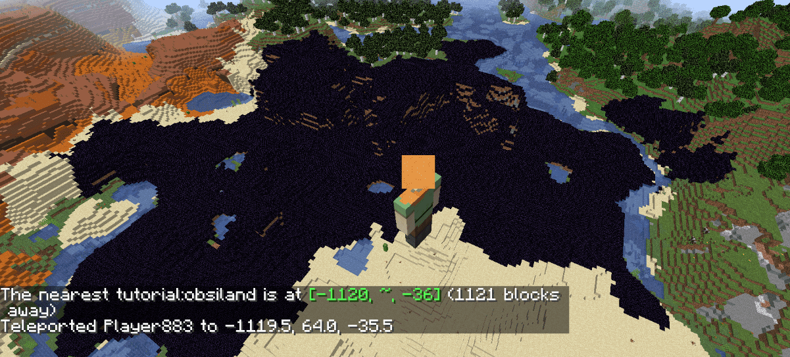

# Adding Biomes \[1.16.3\]

There are 3 steps that are required to add a biome to the world.

- Creating a biome
- Registering a biome
- Adding a biome to a climate zone in the world

In this tutorial, we will add new biome called obsiland biome, whose
surface is covered with obsidians.

Note that this tutorial depends on [the Biome API in Fabric
API](https://github.com/FabricMC/fabric/pull/1053) which is marked as
experimental. If the API doesn't work, consider using [the mixin
version](../?rev=1602901100.md).

### Creating a Biome

To create a biome, use `Biome.Builder` and configure properties. Missing
one property will likely cause the game to crash. It is recommended to
look at vanilla biomes (created in `DefaultBiomeCreator`) as examples.

```java
public class ExampleMod implements ModInitializer {
  // SurfaceBuilder defines how the surface of your biome looks.
  // We use custom surface builder for our biome to cover surface with obsidians.
  private static final ConfiguredSurfaceBuilder<TernarySurfaceConfig> OBSIDIAN_SURFACE_BUILDER = SurfaceBuilder.DEFAULT
    .withConfig(new TernarySurfaceConfig(
      Blocks.OBSIDIAN.getDefaultState(),
      Blocks.DIRT.getDefaultState(),
      Blocks.GRAVEL.getDefaultState()));

  private static final Biome OBSILAND = createObsiland();

  private static Biome createObsiland() {
    // We specify what entities spawn and what features generate in the biome.
    // Aside from some structures, trees, rocks, plants and
    //   custom entities, these are mostly the same for each biome.
    // Vanilla configured features for biomes are defined in DefaultBiomeFeatures.

    SpawnSettings.Builder spawnSettings = new SpawnSettings.Builder();
    DefaultBiomeFeatures.addFarmAnimals(spawnSettings);
    DefaultBiomeFeatures.addMonsters(spawnSettings, 95, 5, 100);

    GenerationSettings.Builder generationSettings = new GenerationSettings.Builder();
    generationSettings.surfaceBuilder(OBSIDIAN_SURFACE_BUILDER);
    DefaultBiomeFeatures.addDefaultUndergroundStructures(generationSettings);
    DefaultBiomeFeatures.addLandCarvers(generationSettings);
    DefaultBiomeFeatures.addDefaultLakes(generationSettings);
    DefaultBiomeFeatures.addDungeons(generationSettings);
    DefaultBiomeFeatures.addMineables(generationSettings);
    DefaultBiomeFeatures.addDefaultOres(generationSettings);
    DefaultBiomeFeatures.addDefaultDisks(generationSettings);
    DefaultBiomeFeatures.addSprings(generationSettings);
    DefaultBiomeFeatures.addFrozenTopLayer(generationSettings);

    return (new Biome.Builder())
      .precipitation(Biome.Precipitation.RAIN)
      .category(Biome.Category.NONE)
      .depth(0.125F)
      .scale(0.05F)
      .temperature(0.8F)
      .downfall(0.4F)
      .effects((new BiomeEffects.Builder())
        .waterColor(0x3f76e4)
        .waterFogColor(0x050533)
        .fogColor(0xc0d8ff)
        .skyColor(0x77adff)
        .build())
      .spawnSettings(spawnSettings.build())
      .generationSettings(generationSettings.build())
      .build();
  }
}
```

### Registering Biomes

We register our biome at the entrypoint `onInitialize`. If you use your
own surface builder, you will also have to register it.

```java
public class ExampleMod implements ModInitializer {
  public static final RegistryKey<Biome> OBSILAND_KEY = RegistryKey.of(Registry.BIOME_KEY, new Identifier("tutorial", "obsiland"));

  @Override
  public void onInitialize() {
    Registry.register(BuiltinRegistries.CONFIGURED_SURFACE_BUILDER, new Identifier("tutorial", "obsidian"), OBSIDIAN_SURFACE_BUILDER);
    Registry.register(BuiltinRegistries.BIOME, OBSILAND_KEY.getValue(), OBSILAND);
  }
}
```

You should also give your biome a language entry in your `en_us.json`
file:

```JavaScript
{
  "biome.tutorial.obsiland": "Obsiland"
}
```

### Adding a biome to a climate zone in the world

We need to specify the climate to which the biome is added, the biome
which we are adding, and the weight of the biome (a double value). The
weight is a measurement of the chance the biome has to spawn. A higher
weight corresponds to a higher chance for the biome to spawn,
proportional to the weights of other biomes. You may want to give your
biome a higher weight during testing so you can find the biome more
easily. In this tutorial, we will add the custom biome to the TEMPERATE
and COOL climates as an example.

```java
public class ExampleMod implements ModInitializer {
  @Override
  public void onInitialize() {
    [...]

    OverworldBiomes.addContinentalBiome(OBSILAND_KEY, OverworldClimate.TEMPERATE, 2D);
    OverworldBiomes.addContinentalBiome(OBSILAND_KEY, OverworldClimate.COOL, 2D);
  }
}
```

### Result

**Congratulations!** Your biome should now be generating in the world!
You can use below command to find your biome in the world.

    /locatebiome tutorial:obsiland


