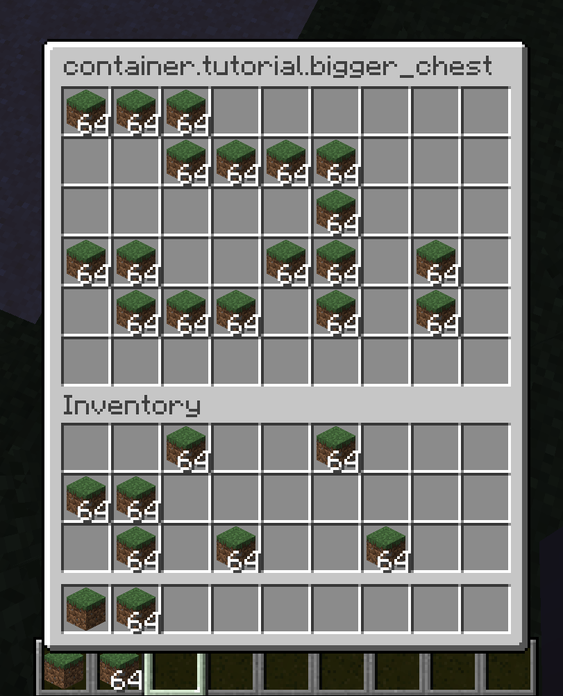

# Creating a Container Block (DRAFT)

We are going to make a bigger chest in this tutorial as an example.

### Block and BlockItem

First we need to create the Block and register it as well as its
BlockItem.

```java
public class BiggerChestBlock extends BlockWithEntity {
    public BiggerChestBlock(Settings settings) {
        super(settings);
    }
    
    // A side effect of extending BlockWithEntity is it changes the render type to INVISIBLE, so we have to revert this
    @Override
    public BlockRenderType getRenderType(BlockState state) {
        return BlockRenderType.MODEL;
    }

    // We will create the BlockEntity later.
    @Override
    public BlockEntity createBlockEntity(BlockView view) {
        return new BiggerChestBlockEntity();
    }

    @Override
    public void onPlaced(World world, BlockPos pos, BlockState state, LivingEntity placer, ItemStack itemStack) {
        if (itemStack.hasCustomName()) {
            BlockEntity blockEntity = world.getBlockEntity(pos);
            if (blockEntity instanceof BiggerChestBlockEntity) {
                ((BiggerChestBlockEntity)blockEntity).setCustomName(itemStack.getName());
            }
        }
    }

    @Override
    public ActionResult onUse(BlockState state, World world, BlockPos pos, PlayerEntity player, Hand hand, BlockHitResult hit) {
        if (!world.isClient) {
            BlockEntity blockEntity = world.getBlockEntity(pos);
            if (blockEntity instanceof BiggerChestBlockEntity) {
                ContainerProviderRegistry.INSTANCE.openContainer(ExampleMod.BIGGER_CHEST, player, buf -> buf.writeBlockPos(pos));
            }
        }
        return ActionResult.SUCCESS;
    }

    // Scatter the items in the chest when it is removed.
    @Override
    public void onBlockRemoved(BlockState state, World world, BlockPos pos, BlockState newState, boolean moved) {
        if (state.getBlock() != newState.getBlock()) {
            BlockEntity blockEntity = world.getBlockEntity(pos);
            if (blockEntity instanceof BiggerChestBlockEntity) {
                ItemScatterer.spawn(world, pos, (BiggerChestBlockEntity)blockEntity);
                // update comparators
                world.updateHorizontalAdjacent(pos, this);
            }
            super.onBlockRemoved(state, world, pos, newState, moved);
        }
    }

    @Override
    public boolean hasComparatorOutput(BlockState state) {
        return true;
    }

    @Override
    public int getComparatorOutput(BlockState state, World world, BlockPos pos) {
        return Container.calculateComparatorOutput(world.getBlockEntity(pos));
    }
}
```

Then we need to register our Block and BlockItem.

```java
public class ExampleMod implements ModInitializer
{
    
    public static final String MOD_ID = "tutorial";

    // a public identifier for multiple parts of our bigger chest
    public static final Identifier BIGGER_CHEST = new Identifier(MOD_ID, "bigger_chest_block");

    public static final Block BIGGER_CHEST_BLOCK = new BiggerChestBlock(FabricBlockSettings.of(Material.METAL));
   
    @Override
    public void onInitialize()
    {
        Registry.register(Registry.BLOCK, BIGGER_CHEST, BIGGER_CHEST_BLOCK);
        Registry.register(Registry.ITEM, BIGGER_CHEST, new BlockItem(BIGGER_CHEST_BLOCK, new Item.Settings().group(ItemGroup.REDSTONE)));
    }
}
```

You may refer to other tutorials to modify the appearance and other
properties of the Block by adding models or adjusting rendering later.

### BlockEntity

BlockEntity is used for managing container inventories. Actually, it
implements Inventory interface. It is required to save and load the
inventory.

```java
public class BiggerChestBlockEntity extends LootableContainerBlockEntity {
    private DefaultedList<ItemStack> inventory;
    private static final int INVENTORY_SIZE = 54; // 9 * 6 = 54

    public BiggerChestBlockEntity() {
        super(ExampleMod.BIGGER_CHEST_ENTITY_TYPE);
        this.inventory = DefaultedList.ofSize(INVENTORY_SIZE, ItemStack.EMPTY);
    }

    @Override
    protected Text getContainerName() {
        return new TranslatableText("container.chest");
    }

    @Override
    protected ScreenHandler createScreenHandler(int syncId, PlayerInventory playerInventory) {
        return new BiggerChestScreenHandler(syncId, playerInventory, (Inventory) this);
    }

    @Override
    protected DefaultedList<ItemStack> getInvStackList() {
        return this.inventory;
    }

    @Override
    protected void setInvStackList(DefaultedList<ItemStack> list) {
        this.inventory = list;
    }

    @Override
    public int size() {
        return INVENTORY_SIZE;
    }

    @Override
    public void fromTag(CompoundTag tag) {
        super.fromTag(tag);
        this.inventory = DefaultedList.ofSize(this.size(), ItemStack.EMPTY);
        if (!this.deserializeLootTable(tag)) {
            Inventories.fromTag(tag, this.inventory);
        }
    }

    @Override
    public CompoundTag toTag(CompoundTag tag) {
        super.toTag(tag);
        if (!this.serializeLootTable(tag)) {
            Inventories.toTag(tag, this.inventory);
        }
        return tag;
    }
}
```

### Container GUI and Screen

We need a ScreenHandler Class and a HandledScreen Class to display and
sync the GUI. ScreenHandler classes are used to synchronize GUI state
between the server and the client. HandledScreen classes are fully
client-sided and are responsible for drawing GUI elements.

```java
public class BiggerChestScreenHandler extends ScreenHandler {
    private final Inventory inventory; // Chest inventory
    private static final int INVENTORY_SIZE = 54; // 6 rows * 9 cols

    protected BiggerChestScreenHandler(int syncId, PlayerInventory playerInventory, Inventory inventory) {
        super(null, syncId); // Since we didn't create a ScreenHandlerType, we will place null here.
        this.inventory = inventory;
        checkSize(inventory, INVENTORY_SIZE);
        inventory.onOpen(playerInventory.player);

        // Creating Slots for GUI. A Slot is essentially a corresponding from inventory ItemStacks to the GUI position.
        int i;
        int j;

        // Chest Inventory 
        for (i = 0; i < 6; i++) {
            for (j = 0; j < 9; j++) {
                this.addSlot(new Slot(inventory, i * 9 + j, 8 + j * 18, 18 + i * 18));
            }
        }


        // Player Inventory (27 storage + 9 hotbar)
        for (i = 0; i < 3; i++) {
            for (j = 0; j < 9; j++) {
                this.addSlot(new Slot(playerInventory, i * 9 + j + 9, 8 + j * 18, 18 + i * 18 + 103 + 18));
            }
        }


        for (j = 0; j < 9; j++) {
            this.addSlot(new Slot(playerInventory, j, 8 + j * 18, 18 + 161 + 18));
        }
    }

    @Override
    public boolean canUse(PlayerEntity player) {
        return this.inventory.canPlayerUse(player);
    }

    // Shift + Player Inv Slot
    @Override
    public ItemStack transferSlot(PlayerEntity player, int invSlot) {
        ItemStack newStack = ItemStack.EMPTY;
        Slot slot = this.slots.get(invSlot);
        if (slot != null && slot.hasStack()) {
            ItemStack originalStack = slot.getStack();
            newStack = originalStack.copy();
            if (invSlot < this.inventory.getInvSize()) {
                if (!this.insertItem(originalStack, this.inventory.getInvSize(), this.slots.size(), true)) {
                    return ItemStack.EMPTY;
                }
            } else if (!this.insertItem(originalStack, 0, this.inventory.getInvSize(), false)) {
                return ItemStack.EMPTY;
            }

            if (originalStack.isEmpty()) {
                slot.setStack(ItemStack.EMPTY);
            } else {
                slot.markDirty();
            }
        }

        return newStack;
    }
}
```

```java
public class BiggerChestScreen extends HandledScreen<BiggerChestScreenHandler> {

    // a path to gui texture, you may replace it with new Identifier(YourMod.MOD_ID, "textures/gui/container/your_container.png");
    private static final Identifier TEXTURE = new Identifier("textures/gui/container/generic_54.png");

    public BiggerChestScreen(BiggerChestScreenHandler handler, PlayerInventory playerInventory, Text title) {
        super(handler, playerInventory, title);
        this.backgroundHeight = 114 + 6 * 18;
    }

    @Override
    protected void drawForeground(MatrixStack matrices, int mouseX, int mouseY) {
        this.textRenderer.draw(matrices, this.title.asString(), 8.0F, 6.0F, 4210752);
        this.textRenderer.draw(matrices, this.playerInventory.getDisplayName().asString(), 8.0F, (float)(this.backgroundHeight - 96 + 2), 4210752);
    }

    @Override
    protected void drawBackground(float delta, int mouseX, int mouseY) {
        RenderSystem.color4f(1.0F, 1.0F, 1.0F, 1.0F);
        this.client.getTextureManager().bindTexture(TEXTURE);
        int i = (this.width - this.backgroundWidth) / 2;
        int j = (this.height - this.backgroundHeight) / 2;
        this.blit(i, j, 0, 0, this.backgroundWidth, 6 * 18 + 17);
        this.blit(i, j + 6 * 18 + 17, 0, 126, this.backgroundWidth, 96);
    }
}
```

Then you need to register them respectively on main initializers and
client initializers.

```java
    [...]
    public static final String BIGGER_CHEST_TRANSLATION_KEY = Util.createTranslationKey("container", BIGGER_CHEST);

    @Override
    public void onInitialize() {
        [...]
        ContainerProviderRegistry.INSTANCE.registerFactory(BIGGER_CHEST, (syncId, identifier, player, buf) -> {
            final World world = player.world;
            final BlockPos pos = buf.readBlockPos();
            return world.getBlockState(pos).createContainerFactory(player.world, pos).createMenu(syncId, player.inventory, player);
        });
    }
```

```java
@Override
public void onInitializeClient() {
    [...]
    ScreenProviderRegistry.INSTANCE.<BiggerChestContainer>registerFactory(ExampleMod.BIGGER_CHEST, (container) -> new BiggerChestScreen(container, MinecraftClient.getInstance().player.inventory, new TranslatableText(ExampleMod.BIGGER_CHEST_TRANSLATION_KEY)));
}
```

### Organizing

After all the steps, you should have your ExampleMod Class and
ExampleClientMod Class as such:

```java
    public static final String MOD_ID = "tutorial";

    public static final Identifier BIGGER_CHEST = new Identifier(MOD_ID, "bigger_chest");
    public static final Block BIGGER_CHEST_BLOCK = new BiggerChestBlock(FabricBlockSettings.of(Material.WOOD).build());
    public static final String BIGGER_CHEST_TRANSLATION_KEY = Util.createTranslationKey("container", BIGGER_CHEST);

    public static BlockEntityType<BiggerChestBlockEntity> BIGGER_CHEST_ENTITY_TYPE;

    @Override
    public void onInitialize() {
        Registry.register(Registry.BLOCK, BIGGER_CHEST, BIGGER_CHEST_BLOCK);
        Registry.register(Registry.ITEM, BIGGER_CHEST, new BlockItem(BIGGER_CHEST_BLOCK, new Item.Settings().group(ItemGroup.REDSTONE)));
        BIGGER_CHEST_ENTITY_TYPE = Registry.register(Registry.BLOCK_ENTITY_TYPE, BIGGER_CHEST, BlockEntityType.Builder.create(BiggerChestBlockEntity::new, BIGGER_CHEST_BLOCK).build(null));
        ContainerProviderRegistry.INSTANCE.registerFactory(BIGGER_CHEST, (syncId, identifier, player, buf) -> {
            final BlockEntity blockEntity = player.world.getBlockEntity(buf.readBlockPos());
            return((BiggerChestBlockEntity) blockEntity).createContainer(syncId, player.inventory);
        });
    }
```

```java
@Override
public void onInitializeClient() {
    ScreenProviderRegistry.INSTANCE.<BiggerChestContainer>registerFactory(ExampleMod.BIGGER_CHEST, (container) -> new BiggerChestScreen(container, MinecraftClient.getInstance().player.inventory, new TranslatableText(ExampleMod.BIGGER_CHEST_TRANSLATION_KEY)));
}
```



It's over and enjoy your custom container!
